# System Architecture

This document describes the technical architecture of Dynamite Notes, including component hierarchies, data flow patterns, routing structure, and deployment architecture.

## Architecture Overview

Dynamite Notes is a **client-side single-page application (SPA)** built with React 18, TypeScript, and Vite. The application follows a component-based architecture with clear separation between presentation (UI), logic (hooks), and utilities (lib).

**Architecture Type**: Client-side rendered (CSR) SPA
**Build Tool**: Vite 5.4 with React SWC
**Deployment**: Static hosting (Vercel, Netlify, Cloudflare Pages)
**Backend**: None (future: API-driven architecture)

### High-Level Architecture Diagram

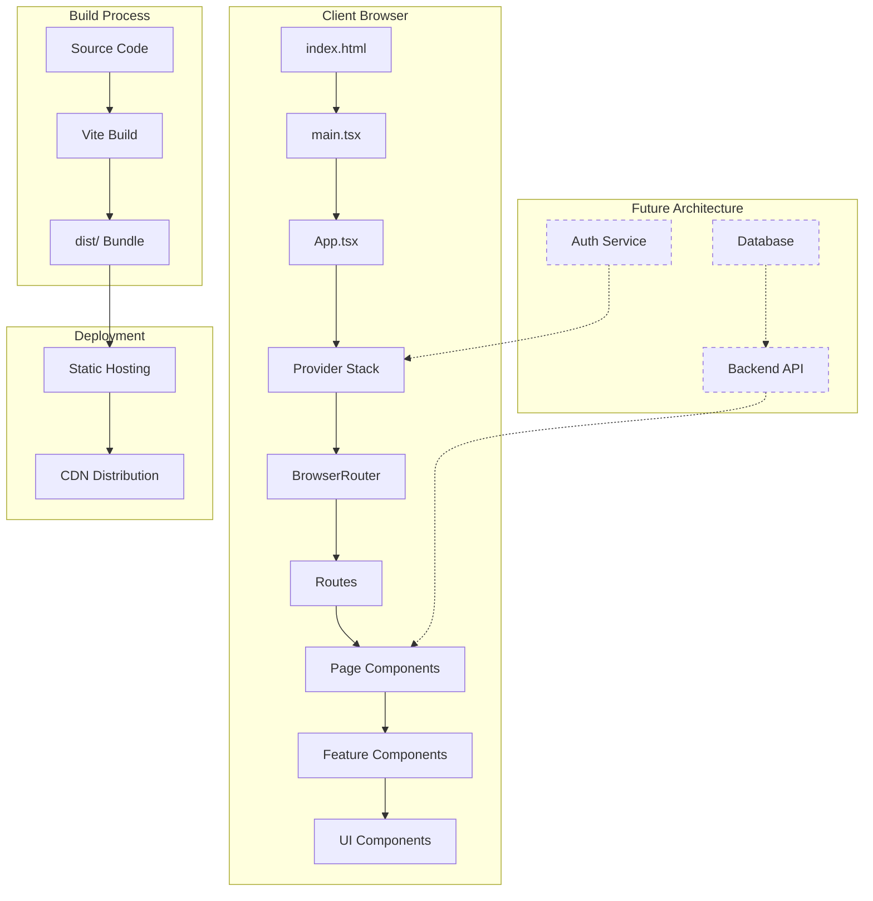

## Application Entry Flow

### Bootstrap Sequence

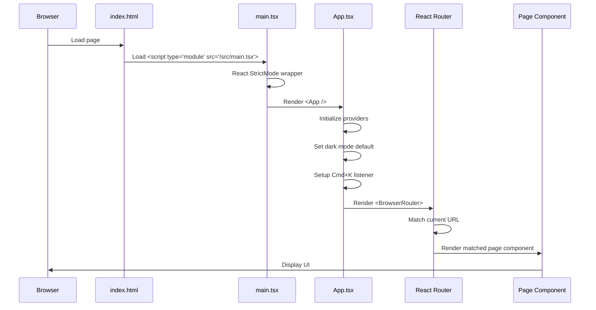

### Provider Hierarchy

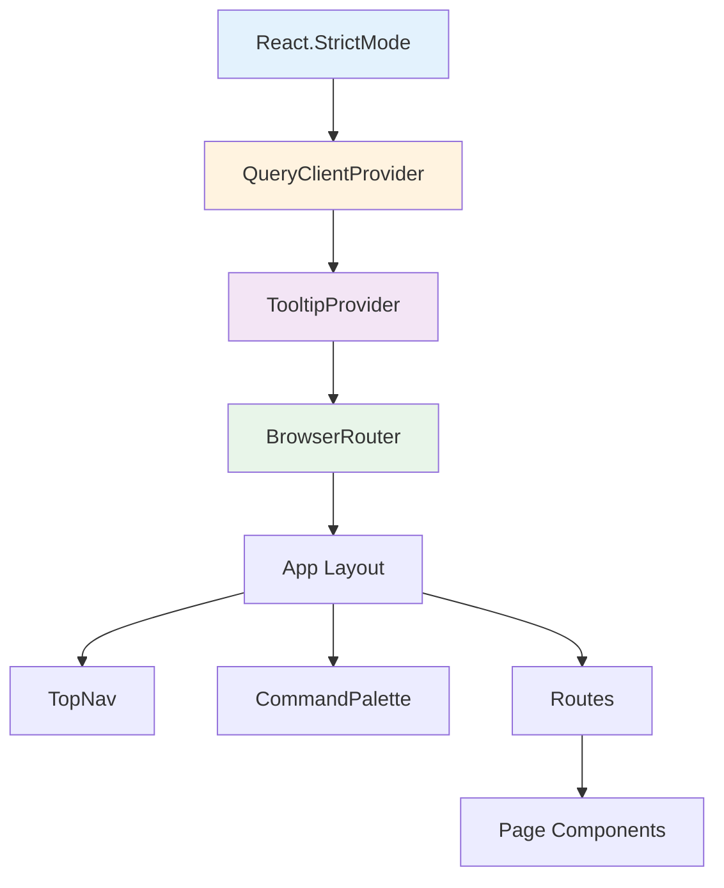

**Provider Responsibilities**:

| Provider | Purpose | Source |
|----------|---------|--------|
| `React.StrictMode` | Development mode checks, warnings | React 18 |
| `QueryClientProvider` | TanStack Query state management (unused) | @tanstack/react-query |
| `TooltipProvider` | Radix tooltip context | @radix-ui/react-tooltip |
| `BrowserRouter` | Client-side routing | react-router-dom |

## Routing Architecture

### Route Structure

```mermaid
graph LR
    A[/] --> B[Index]
    C[/packages] --> D[Packages]
    E[/packages/:packageId] --> D
    F[/packages/:packageId/:itemId] --> D
    G[/docs] --> H[Docs]
    I[/docs/:docId] --> H
    J[/playground] --> K[Playground]
    L[/playground/:playgroundId] --> K
    M[/changelog] --> N[Changelog]
    O[/*] --> P[NotFound]

    style B fill:#c8e6c9
    style D fill:#fff9c4
    style H fill:#ffccbc
    style K fill:#b3e5fc
    style N fill:#f8bbd0
    style P fill:#ffcdd2
```

### Route Configuration

| Route | Component | Props from URL | Purpose |
|-------|-----------|----------------|---------|
| `/` | `Index` | - | Landing page with mode selector, packages, changelog |
| `/packages` | `Packages` | - | Package catalog with difficulty filter |
| `/packages/:packageId` | `Packages` | `packageId` | Specific package detail view |
| `/packages/:packageId/:itemId` | `Packages` | `packageId`, `itemId` | Individual package item |
| `/docs` | `Docs` | - | Document library listing |
| `/docs/:docId` | `Docs` | `docId` | Specific document view |
| `/playground` | `Playground` | - | Interactive tools listing |
| `/playground/:playgroundId` | `Playground` | `playgroundId` | Specific tool |
| `/changelog` | `Changelog` | - | Version history |
| `/*` | `NotFound` | - | 404 page |

**URL State Management**:
- `useSearchParams()` for query strings (e.g., `?mode=ai`, `?difficulty=advanced`)
- `useParams()` for route parameters (e.g., `/packages/:packageId`)
- `useNavigate()` for programmatic navigation

## Component Architecture

### Component Hierarchy

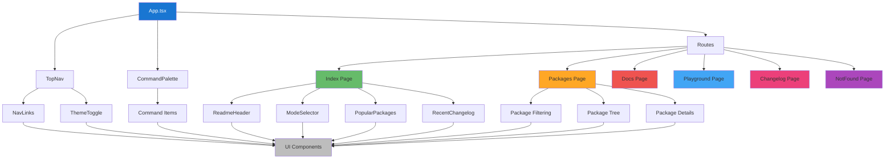

### Component Categories

**1. Layout Components** (`src/components/layout/`):
- `TopNav.tsx` - Global navigation bar
- `CommandPalette.tsx` - Cmd+K search interface
- `ThemeToggle.tsx` - Dark/light mode switcher

**2. Home Components** (`src/components/home/`):
- `ReadmeHeader.tsx` - Project intro section
- `ModeSelector.tsx` - PM/AI/Snack mode filter
- `PopularPackages.tsx` - Featured package cards
- `RecentChangelog.tsx` - Latest updates preview

**3. UI Components** (`src/components/ui/`):
- 48 shadcn-ui primitives (buttons, dialogs, forms, etc.)
- Never modify directly (regenerate via `npx shadcn-ui add`)

**4. Page Components** (`src/pages/`):
- 6 route-level components (Index, Packages, Docs, Playground, Changelog, NotFound)

**5. Utility Components**:
- `NavLink.tsx` - Router-aware navigation link

### Component Communication Patterns

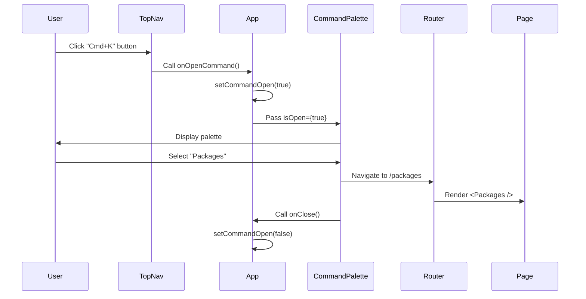

**Patterns Used**:
- **Props Drilling**: Parent passes callbacks to children (1-2 levels max)
- **URL State**: Components read/write search params for shareable state
- **Local State**: Each component manages its own UI state
- **No Global State**: No Redux, Zustand, or Context for state (yet)

## Data Flow Architecture

### Current: Static Data Flow

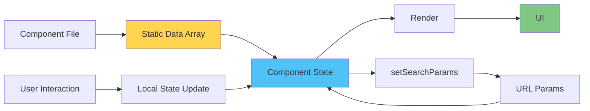

**Example** (Packages Page):
1. `packagesData` array defined in component file
2. Component reads `difficulty` from URL search params
3. Component filters `packagesData` by difficulty
4. Filtered data renders as package cards
5. User clicks difficulty filter → updates URL → re-filters data

### Future: API-Driven Data Flow

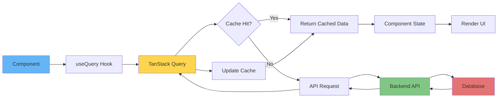

**Planned Pattern**:
```typescript
// Future API integration
const { data: packages, isLoading } = useQuery({
  queryKey: ["packages"],
  queryFn: () => api.get("/packages"),
  staleTime: 5 * 60 * 1000, // 5 minutes
});
```

## State Management

### State Types & Locations

| State Type | Storage | Persistence | Example |
|------------|---------|-------------|---------|
| **UI State** | `useState` | Session (lost on refresh) | `isOpen`, `selectedTab` |
| **URL State** | `useSearchParams` | Persistent (in URL) | `?mode=ai`, `?difficulty=advanced` |
| **Route Params** | `useParams` | Persistent (in URL) | `/packages/:packageId` |
| **Form State** | `react-hook-form` | Session | Form inputs |
| **Server State** (future) | TanStack Query | Cache (configurable) | API responses |
| **Global State** (future) | Context API / Zustand | Session | User profile, auth |

### State Flow Diagram

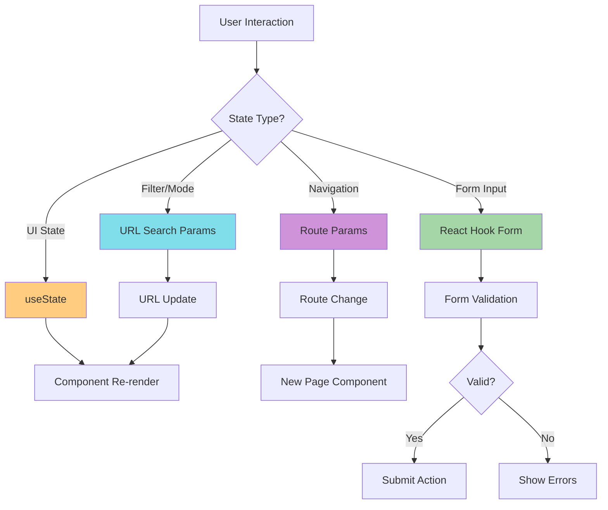

## Build & Deployment Architecture

### Build Process

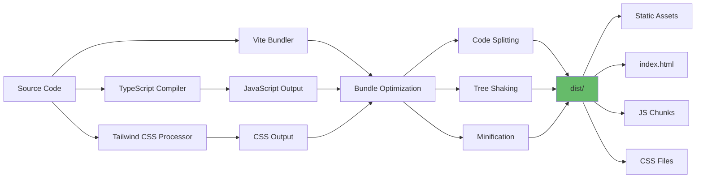

**Build Outputs**:
- `dist/index.html` - Entry HTML file
- `dist/assets/*.js` - JavaScript chunks (code-split by route)
- `dist/assets/*.css` - Compiled and purged Tailwind CSS
- `dist/assets/*.svg`, `*.png` - Static assets

**Optimization Techniques**:
- **Code Splitting**: Automatic by route (React Router + Vite)
- **Tree Shaking**: Remove unused library code
- **Minification**: JavaScript and CSS compression
- **CSS Purging**: Remove unused Tailwind classes (reduces CSS by ~95%)

### Deployment Architecture

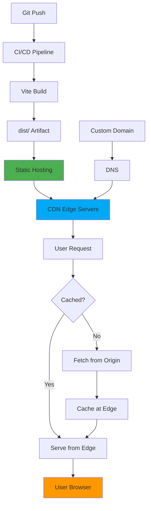

**Deployment Platforms** (Static Hosting):
- **Vercel** (recommended): Zero-config, automatic deployments, edge network
- **Netlify**: Similar features, good CDN, custom headers support
- **Cloudflare Pages**: Fast global CDN, DDoS protection
- **GitHub Pages**: Free, simple, good for open-source projects

**Deployment Steps**:
1. Push code to Git repository (GitHub, GitLab, Bitbucket)
2. Hosting platform detects push via webhook
3. Platform runs `bun build` (or `npm run build`)
4. Platform deploys `dist/` folder to CDN
5. Platform assigns URL (e.g., `https://project.vercel.app`)
6. Platform distributes assets to edge servers globally

### Environment Configuration

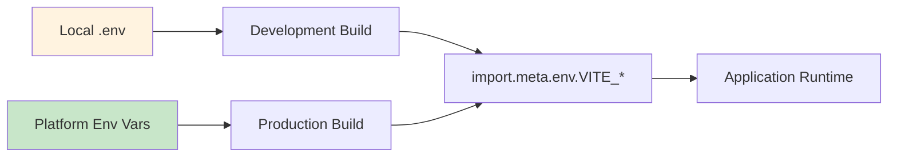

**Environment Variable Naming**:
- Prefix with `VITE_` for client-side access
- Example: `VITE_API_URL`, `VITE_ANALYTICS_ID`

**Usage**:
```typescript
const apiUrl = import.meta.env.VITE_API_URL || "https://api.default.com";
```

## Security Architecture

### Current Security Posture

**Threat Model**:
- **No backend** → No API vulnerabilities (yet)
- **No auth** → No credential theft risk (yet)
- **Client-side only** → Limited attack surface

**Security Measures**:
- HTTPS enforced (via hosting platform)
- Content Security Policy (CSP) headers (configured at hosting level)
- Dependency vulnerability scanning (npm audit, Dependabot)
- No sensitive data in client-side code

### Future Security Architecture

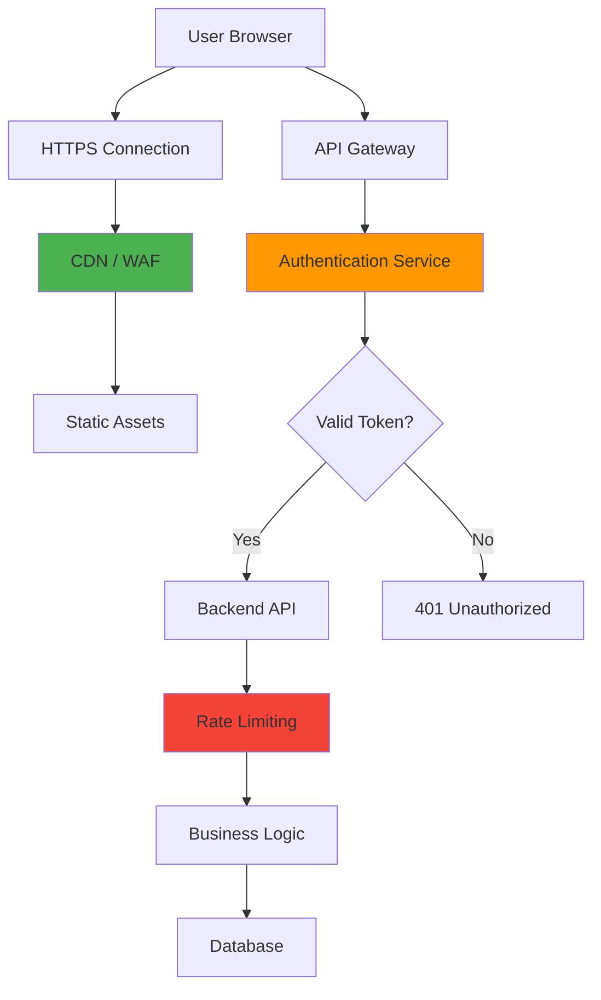

**Planned Security Features**:
- **Authentication**: JWT tokens, secure cookie storage
- **Authorization**: Role-based access control (RBAC)
- **Rate Limiting**: Prevent abuse of API endpoints
- **Input Validation**: Zod schemas for all user inputs
- **CSRF Protection**: Anti-CSRF tokens for state-changing operations
- **XSS Prevention**: React's automatic escaping + CSP headers

## Performance Architecture

### Performance Budget

| Metric | Target | Current |
|--------|--------|---------|
| Largest Contentful Paint (LCP) | < 2.0s | ~1.5s (static) |
| First Input Delay (FID) | < 100ms | < 50ms |
| Cumulative Layout Shift (CLS) | < 0.1 | < 0.05 |
| Time to Interactive (TTI) | < 3.0s | ~2.0s |
| Total Bundle Size (gzip) | < 200KB | ~150KB (JS) |

### Performance Optimization Strategies

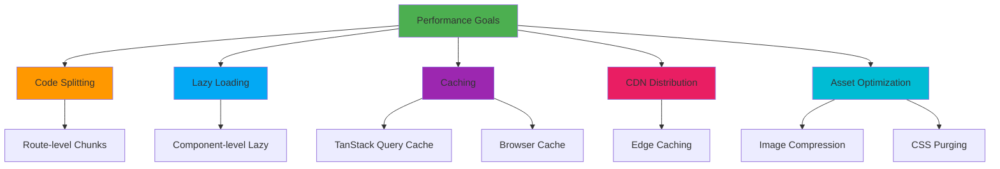

**Implemented Optimizations**:
1. **Route-based code splitting** (automatic with Vite + React Router)
2. **Tailwind CSS purging** (removes unused classes in production)
3. **Tree shaking** (removes unused library code)
4. **SWC compilation** (faster than Babel, smaller output)
5. **CDN delivery** (edge caching, global distribution)

**Future Optimizations**:
- Lazy load heavy components (charts, editors)
- Image optimization (WebP format, lazy loading)
- Service worker for offline caching
- Preload critical resources

## Monitoring & Observability (Future)

### Planned Monitoring Architecture

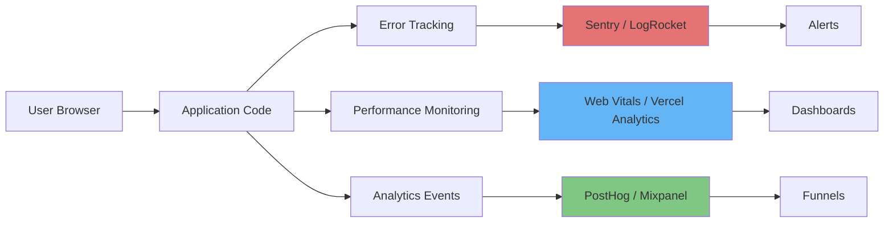

**Metrics to Track**:
- **Errors**: JavaScript exceptions, failed API calls, unhandled promises
- **Performance**: Core Web Vitals, route transition times, API latency
- **User Behavior**: Page views, button clicks, feature usage, conversion funnels
- **Business Metrics**: User sign-ups, content completions, retention rates

## Technology Stack Summary

### Frontend Stack

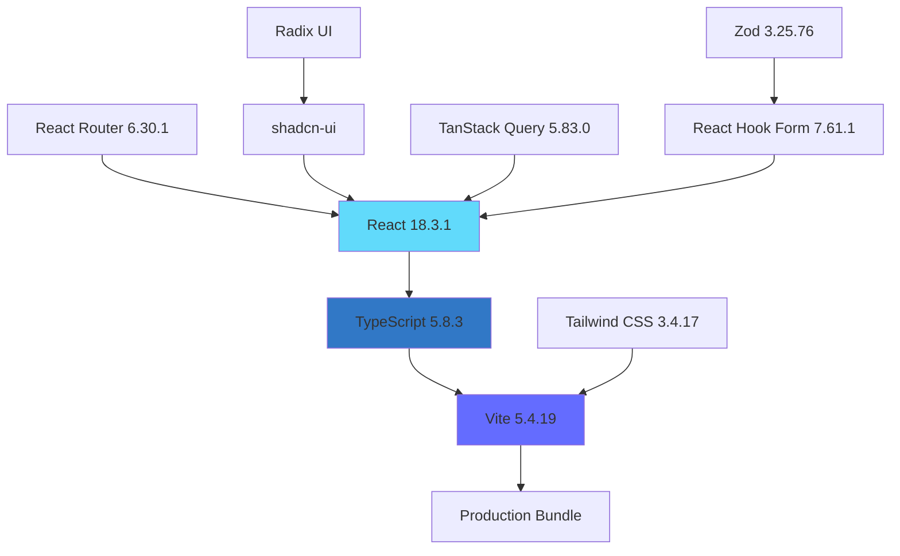

### Build & Tooling Stack

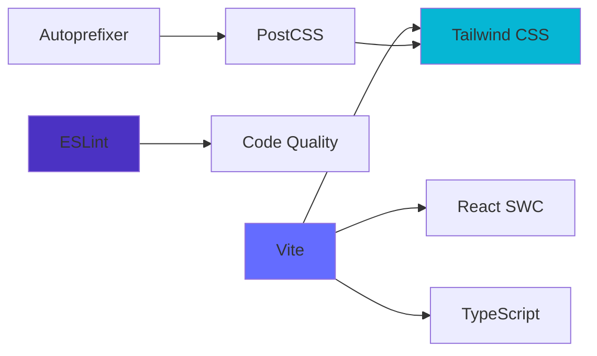

**Key Technologies**:
- **Framework**: React 18.3.1
- **Language**: TypeScript 5.8.3
- **Build Tool**: Vite 5.4.19 with @vitejs/plugin-react-swc
- **Routing**: React Router DOM 6.30.1
- **Styling**: Tailwind CSS 3.4.17, @tailwindcss/typography
- **UI Components**: shadcn-ui (48 components) built on Radix UI
- **State Management**: TanStack Query 5.83.0 (configured, unused)
- **Forms**: React Hook Form 7.61.1, Zod 3.25.76
- **Icons**: Lucide React 0.462.0
- **Utilities**: class-variance-authority, clsx, tailwind-merge
- **Notifications**: Sonner 1.7.4
- **Theme**: next-themes 0.3.0
- **Charts**: Recharts 2.15.4
- **Date Handling**: date-fns 3.6.0

## Architecture Evolution

### Current Architecture (v2.4.0)

**Characteristics**:
- Client-side rendering only
- Static data in component files
- No backend or database
- No authentication
- Limited interactivity

**Strengths**:
- Fast development iteration
- Simple deployment (static hosting)
- No infrastructure management
- Low cost (hosting is free/cheap)

**Limitations**:
- No personalization
- No user-generated content
- No progress tracking
- SEO challenges (CSR only)
- No real-time features

### Future Architecture (v3.x+)

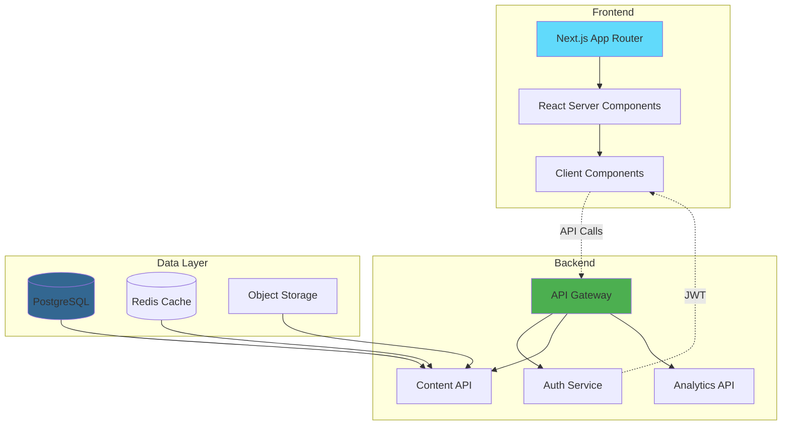

**Planned Enhancements**:
- **Backend API**: RESTful or GraphQL API for dynamic content
- **Database**: PostgreSQL for relational data, Redis for caching
- **Authentication**: JWT-based auth with social login
- **Server-Side Rendering**: Next.js for improved SEO and performance
- **Real-time Features**: WebSockets for live collaboration (future)
- **Content Management**: Headless CMS for non-technical content updates

---

**Document Version**: 1.0
**Last Updated**: 2026-01-13
**Next Review**: Q2 2026
**Architecture Owner**: Engineering Team
