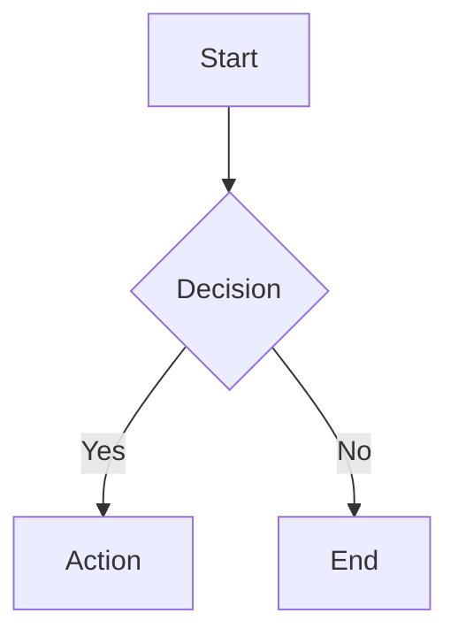

# Mermaid + React-Markdown Integration Research

**Date:** 2026-01-15
**Target:** React 18, TypeScript, Vite
**Focus:** Production-ready integration with theme switching, error handling, and performance

---

## Executive Summary

**Recommendation:** Use **core `mermaid` package** (not wrappers) with **custom React component** integrated via **react-markdown custom components**. React wrappers (`react-mermaid`, etc.) add unnecessary abstraction, larger bundles, and maintenance overhead.

**Key Findings:**
- Core `mermaid` package: ~148KB gzipped, actively maintained
- React wrappers: Core mermaid + wrapper code = larger, often outdated
- Best practice: Custom component with lazy loading + error boundaries
- Theme switching: Requires `mermaid.initialize()` re-call + re-render

---

## 1. Package Selection

### Core `mermaid` Package (RECOMMENDED)

```bash
npm install mermaid
```

**Advantages:**
- Smallest bundle size (~148KB gzipped)
- Full API access and control
- Active development (v11+ in 2024)
- Direct updates from mermaid-js team
- Better TypeScript support

**Disadvantages:**
- Manual DOM lifecycle management
- Requires React integration code

**Verdict:** ✅ **RECOMMENDED** for production use

### React Wrappers (NOT RECOMMENDED)

Available options:
- `react-mermaid` - Outdated, last update 2022
- `react-x-mermaid` - Less common
- Other community wrappers

**Issues:**
- Larger bundle (mermaid + wrapper code)
- Often abandoned or outdated
- Limited customization
- Wrapper bugs add complexity
- Performance depends on wrapper quality

**Verdict:** ❌ Avoid for production

---

## 2. Integration with react-markdown

### Approach: Custom Code Component

Override `code` block in react-markdown `components` prop:

```tsx
import ReactMarkdown from 'react-markdown'
import { MermaidDiagram } from './MermaidDiagram'

function MarkdownWithMermaid({ content }: { content: string }) {
  return (
    <ReactMarkdown
      components={{
        code({ node, inline, className, children, ...props }) {
          const match = /language-(\w+)/.exec(className || '')
          const language = match ? match[1] : ''

          // Handle mermaid code blocks
          if (language === 'mermaid') {
            return <MermaidDiagram chart={String(children).replace(/\n$/, '')} />
          }

          // Handle other code blocks (syntax highlighting, etc.)
          return (
            <code className={className} {...props}>
              {children}
            </code>
          )
        }
      }}
    >
      {content}
    </ReactMarkdown>
  )
}
```

### Markdown Format

```markdown
Here's a flowchart:



And here's some code:

```javascript
console.log('Hello')
```
```

---

## 3. Mermaid Diagram Component (TypeScript)

### Full Implementation

```tsx
// MermaidDiagram.tsx
import { useEffect, useRef, useState } from 'react'
import mermaid from 'mermaid'

interface MermaidDiagramProps {
  chart: string
  theme?: 'default' | 'neutral' | 'dark' | 'forest'
  config?: mermaid.Config
}

export function MermaidDiagram({
  chart,
  theme = 'default',
  config
}: MermaidDiagramProps) {
  const ref = useRef<HTMLDivElement>(null)
  const [error, setError] = useState<string | null>(null)
  const [loading, setLoading] = useState(true)

  useEffect(() => {
    let isMounted = true

    async function renderDiagram() {
      if (!ref.current) return

      try {
        setLoading(true)
        setError(null)

        // Initialize mermaid with theme
        await mermaid.initialize({
          startOnLoad: false,
          theme,
          securityLevel: 'loose',
          ...config
        })

        // Generate unique ID
        const id = `mermaid-${Math.random().toString(36).substr(2, 9)}`

        // Render diagram
        const { svg } = await mermaid.render(id, chart)

        if (isMounted && ref.current) {
          ref.current.innerHTML = svg
          setLoading(false)
        }
      } catch (err) {
        if (isMounted) {
          setError(err instanceof Error ? err.message : 'Failed to render diagram')
          setLoading(false)
        }
      }
    }

    renderDiagram()

    return () => {
      isMounted = false
    }
  }, [chart, theme, config])

  if (error) {
    return (
      <div className="mermaid-error">
        <p>Failed to render diagram:</p>
        <pre>{error}</pre>
        <details>
          <summary>Chart source</summary>
          <pre>{chart}</pre>
        </details>
      </div>
    )
  }

  if (loading) {
    return <div className="mermaid-loading">Loading diagram...</div>
  }

  return <div ref={ref} className="mermaid-diagram" />
}
```

### Props TypeScript Types

```typescript
import type { Config } from 'mermaid'

interface MermaidDiagramProps {
  chart: string
  theme?: 'default' | 'neutral' | 'dark' | 'forest' | 'base'
  config?: Config
}
```

---

## 4. Dark/Light Mode Theme Switching

### Strategy: Theme Detection + Re-initialization

**Challenge:** Mermaid requires re-initialization on theme change.

### Implementation A: System Theme Detection

```tsx
import { useEffect, useState } from 'react'
import mermaid from 'mermaid'

function useMermaidTheme() {
  const [theme, setTheme] = useState<'light' | 'dark'>('light')

  useEffect(() => {
    // Check initial theme
    const mediaQuery = window.matchMedia('(prefers-color-scheme: dark)')
    setTheme(mediaQuery.matches ? 'dark' : 'light')

    // Listen for changes
    const handler = (e: MediaQueryListEvent) => {
      setTheme(e.matches ? 'dark' : 'light')
    }

    mediaQuery.addEventListener('change', handler)
    return () => mediaQuery.removeEventListener('change', handler)
  }, [])

  return theme
}
```

### Implementation B: App Theme Context

```tsx
// ThemeContext.tsx
import { createContext, useContext, useState } from 'react'

type Theme = 'light' | 'dark'

const ThemeContext = createContext<{
  theme: Theme
  toggleTheme: () => void
} | null>(null)

export function ThemeProvider({ children }: { children: React.ReactNode }) {
  const [theme, setTheme] = useState<Theme>('light')

  const toggleTheme = () => {
    setTheme(prev => prev === 'light' ? 'dark' : 'light')
  }

  return (
    <ThemeContext.Provider value={{ theme, toggleTheme }}>
      <div data-theme={theme}>{children}</div>
    </ThemeContext.Provider>
  )
}

export const useTheme = () => useContext(ThemeContext)!
```

### Mermaid Theme Mapping

```tsx
function getMermaidTheme(appTheme: 'light' | 'dark'): mermaid.Config {
  return {
    theme: appTheme === 'dark' ? 'dark' : 'default',
    themeVariables: appTheme === 'dark' ? {
      darkMode: true,
      background: '#1e1e1e',
      primaryColor: '#bb2528',
      primaryTextColor: '#fff',
      // ... more variables
    } : {
      darkMode: false,
      background: '#ffffff',
      primaryColor: '#006100',
      primaryTextColor: '#fff',
      // ... more variables
    }
  }
}
```

### Updated Component with Theme

```tsx
export function MermaidDiagram({ chart }: { chart: string }) {
  const { theme } = useTheme()
  const mermaidTheme = getMermaidTheme(theme)

  // ... rest of component uses mer
  // Pass mermaidTheme to mermaid.initialize()
}
```

### Custom Theme Variables

```typescript
const customTheme: mermaid.Config = {
  theme: 'base',
  themeVariables: {
    // Colors
    primaryColor: '#ff6347',
    primaryTextColor: '#fff',
    primaryBorderColor: '#7c0000',
    lineColor: '#f8b229',
    secondaryColor: '#006100',
    tertiaryColor: '#fff',

    // Typography
    fontFamily: 'arial, sans-serif',
    fontSize: 16,

    // Dark mode
    darkMode: false,

    // Diagram-specific
    mainBkg: '#e1e1e1',
    nodeBorder: '#999',
    clusterBkg: '#ccc',
    textColor: '#333'
  }
}
```

**Available themeVariables:**
- `primaryColor`, `primaryTextColor`, `primaryBorderColor`
- `secondaryColor`, `secondaryTextColor`
- `tertiaryColor`, `tertiaryTextColor`
- `lineColor`, `textColor`, `borderColor`
- `mainBkg`, `nodeBorder`, `clusterBkg`
- `fontFamily`, `fontSize`
- `darkMode` (boolean)

---

## 5. Error Handling & Fallback Strategies

### Multi-Layer Approach

**Layer 1: Try-Catch in Component**
```tsx
try {
  const { svg } = await mermaid.render(id, chart)
  // ...
} catch (err) {
  setError(err.message)
  // Show fallback UI
}
```

**Layer 2: Error Boundary**

```tsx
// MermaidErrorBoundary.tsx
import React from 'react'

interface Props {
  children: React.ReactNode
  fallback?: React.ReactNode
}

interface State {
  hasError: boolean
  error?: Error
}

export class MermaidErrorBoundary extends React.Component<Props, State> {
  constructor(props: Props) {
    super(props)
    this.state = { hasError: false }
  }

  static getDerivedStateFromError(error: Error): State {
    return { hasError: true, error }
  }

  componentDidCatch(error: Error, errorInfo: React.ErrorInfo) {
    console.error('Mermaid rendering error:', error, errorInfo)
  }

  render() {
    if (this.state.hasError) {
      return this.props.fallback || (
        <div className="mermaid-error-boundary">
          <h3>Diagram unavailable</h3>
          {this.state.error && (
            <details>
              <summary>Error details</summary>
              <pre>{this.state.error.message}</pre>
            </details>
          )}
        </div>
      )
    }

    return this.props.children
  }
}
```

**Layer 3: Parse Validation**

```tsx
// Validate before rendering
async function validateMermaidSyntax(chart: string): Promise<boolean> {
  try {
    await mermaid.parse(chart)
    return true
  } catch {
    return false
  }
}

// In component
const isValid = await validateMermaidSyntax(chart)
if (!isValid) {
  return <div className="mermaid-invalid">Invalid Mermaid syntax</div>
}
```

### Fallback UI Options

**Option 1: Show Source Code**
```tsx
if (error) {
  return (
    <div className="mermaid-fallback">
      <p>Could not render diagram</p>
      <pre><code>{chart}</code></pre>
    </div>
  )
}
```

**Option 2: Show Placeholder**
```tsx
if (error) {
  return (
    <div className="mermaid-placeholder">
      <svg /* placeholder icon */ />
      <p>Diagram temporarily unavailable</p>
    </div>
  )
}
```

**Option 3: Attempt Re-render**
```tsx
const [retryCount, setRetryCount] = useState(0)

useEffect(() => {
  if (retryCount < 3) {
    // Attempt render
  }
}, [retryCount])
```

---

## 6. Performance Considerations

### Lazy Loading Mermaid

**Strategy:** Dynamic import to reduce initial bundle

```tsx
// MermaidDiagram.tsx
import { lazy, Suspense } from 'react'

const MermaidDiagram = lazy(() => import('./MermaidDiagram'))

// Usage
<Suspense fallback={<div>Loading diagram...</div>}>
  <MermaidDiagram chart={chart} />
</Suspense>
```

### Load Mermaid Only When Needed

```tsx
// Detect if markdown contains mermaid blocks
function hasMermaidCharts(markdown: string): boolean {
  return /```mermaid\n[\s\S]*?```/.test(markdown)
}

// Conditional import
if (hasMermaidCharts(markdownContent)) {
  const { MermaidDiagram } = await import('./MermaidDiagram')
}
```

### Dynamic Mermaid Import

```tsx
// Instead of: import mermaid from 'mermaid'
// Use:
const mermaid = await import('mermaid')
```

### Debounce Re-renders

```tsx
import { debounce } from 'lodash-es' // or custom

const debouncedRender = debounce(async (chart: string) => {
  // mermaid rendering
}, 300)

useEffect(() => {
  debouncedRender(chart)
  return () => debouncedRender.cancel()
}, [chart])
```

### Memoization

```tsx
import { useMemo } from 'react'

const renderedSvg = useMemo(() => {
  return mermaid.render(id, chart)
}, [chart])
```

### Bundle Size Optimization

**Vite Configuration:**

```js
// vite.config.ts
import { defineConfig } from 'vite'

export default defineConfig({
  build: {
    rollupOptions: {
      output: {
        manualChunks: {
          'mermaid': ['mermaid']
        }
      }
    }
  }
})
```

### Performance Tips Summary

1. ✅ Lazy load Mermaid component
2. ✅ Load mermaid package only when charts present
3. ✅ Debounce frequent re-renders (live editors)
4. ✅ Memoize rendered output
5. ✅ Code splitting with manual chunks
6. ✅ Use Suspense for loading states
7. ✅ Consider virtual scrolling for many diagrams

---

## 7. Complete Production Example

### File Structure

```
src/
├── components/
│   ├── markdown/
│   │   ├── MarkdownRenderer.tsx       # Main react-markdown wrapper
│   │   ├── MermaidDiagram.tsx         # Mermaid component
│   │   └── MermaidErrorBoundary.tsx   # Error boundary
│   └── theme/
│       ├── ThemeContext.tsx           # Theme provider
│       └── useTheme.ts                # Theme hook
├── hooks/
│   └── useMermaid.ts                  # Mermaid loading hook
└── utils/
    └── mermaid.ts                     # Mermaid config helpers
```

### MarkdownRenderer Component

```tsx
import ReactMarkdown from 'react-markdown'
import remarkGfm from 'remark-gfm'
import { MermaidDiagram } from './MermaidDiagram'
import { MermaidErrorBoundary } from './MermaidErrorBoundary'

interface MarkdownRendererProps {
  content: string
}

export function MarkdownRenderer({ content }: MarkdownRendererProps) {
  return (
    <ReactMarkdown
      remarkPlugins={[remarkGfm]}
      components={{
        code({ node, inline, className, children, ...props }) {
          const match = /language-(\w+)/.exec(className || '')
          const language = match ? match[1] : ''
          const code = String(children).replace(/\n$/, '')

          if (language === 'mermaid') {
            return (
              <MermaidErrorBoundary>
                <MermaidDiagram chart={code} />
              </MermaidErrorBoundary>
            )
          }

          // Handle other languages (syntax highlighting)
          return (
            <code className={className} {...props}>
              {children}
            </code>
          )
        }
      }}
    >
      {content}
    </ReactMarkdown>
  )
}
```

### Mermaid Loading Hook

```tsx
// hooks/useMermaid.ts
import { useEffect, useState } from 'react'

export function useMermaid() {
  const [isLoaded, setIsLoaded] = useState(false)
  const [error, setError] = useState<Error | null>(null)

  useEffect(() => {
    let isMounted = true

    async function loadMermaid() {
      try {
        const mermaid = (await import('mermaid')).default
        await mermaid.initialize({
          startOnLoad: false,
          securityLevel: 'loose'
        })

        if (isMounted) {
          setIsLoaded(true)
        }
      } catch (err) {
        if (isMounted) {
          setError(err instanceof Error ? err : new Error('Failed to load mermaid'))
        }
      }
    }

    loadMermaid()

    return () => {
      isMounted = false
    }
  }, [])

  return { isLoaded, error }
}
```

### Mermaid Config Helper

```tsx
// utils/mermaid.ts
import type { Config } from 'mermaid'

export function getMermaidConfig(
  theme: 'light' | 'dark',
  customVars?: Partial<Config['themeVariables']>
): Config {
  return {
    theme: theme === 'dark' ? 'dark' : 'default',
    startOnLoad: false,
    securityLevel: 'loose',
    logLevel: 'error',
    themeVariables: {
      darkMode: theme === 'dark',
      ...customVars
    }
  }
}
```

### Complete Usage Example

```tsx
// App.tsx
import { ThemeProvider, useTheme } from './components/theme/ThemeContext'
import { MarkdownRenderer } from './components/markdown/MarkdownRenderer'

const markdownContent = `
# My Document

Here's a flowchart:

\`\`\`mermaid
graph TD
    A[Start] --> B{Decision}
    B -->|Yes| C[Action]
    B -->|No| D[End]
\`\`\`

Here's a sequence diagram:

\`\`\`mermaid
sequenceDiagram
    participant Alice
    participant Bob
    Alice->>Bob: Hello
    Bob-->>Alice: Hi!
\`\`\`
`

function AppContent() {
  const { theme, toggleTheme } = useTheme()

  return (
    <div className="app">
      <button onClick={toggleTheme}>
        Toggle theme ({theme})
      </button>
      <MarkdownRenderer content={markdownContent} />
    </div>
  )
}

function App() {
  return (
    <ThemeProvider>
      <AppContent />
    </ThemeProvider>
  )
}

export default App
```

---

## 8. TypeScript Configuration

### Component Props Types

```typescript
// types/mermaid.ts
import type { Config } from 'mermaid'

export interface MermaidDiagramProps {
  chart: string
  theme?: 'default' | 'neutral' | 'dark' | 'forest' | 'base'
  config?: Config
  onError?: (error: Error) => void
  onLoad?: () => void
}

export interface MermaidThemeConfig {
  light: Config
  dark: Config
}
```

### React-Markdown Types

```typescript
import type { Components } from 'react-markdown'

const markdownComponents: Components = {
  code(props) {
    // props is properly typed
    const { children, className, node, ...rest } = props
    // ...
  }
}
```

---

## 9. Common Issues & Solutions

### Issue: Hydration Mismatch (Next.js)

**Problem:** Server-rendered HTML differs from client-rendered Mermaid SVG

**Solution:** Client-side only rendering

```tsx
import { useEffect, useState } from 'react'

export function MermaidDiagram({ chart }: { chart: string }) {
  const [isClient, setIsClient] = useState(false)

  useEffect(() => {
    setIsClient(true)
  }, [])

  if (!isClient) {
    return <div className="mermaid-placeholder">Loading...</div>
  }

  return <ClientMermaidDiagram chart={chart} />
}
```

### Issue: Theme Change Not Reflecting

**Problem:** Diagrams don't update when theme changes

**Solution:** Force re-render with key

```tsx
const { theme } = useTheme()

<MermaidDiagram
  key={`${theme}-${chartHash}`}
  chart={chart}
  theme={theme}
/>
```

### Issue: Multiple Diagrams Interfering

**Problem:** IDs collide when rendering multiple diagrams

**Solution:** Unique IDs per instance

```tsx
const id = useMemo(() =>
  `mermaid-${Math.random().toString(36).substr(2, 9)}`,
  []
)
```

### Issue: Large Diagrams Slow Rendering

**Problem:** Complex diagrams block UI

**Solution:** Timeout + progressive loading

```tsx
const [shouldRender, setShouldRender] = useState(false)

useEffect(() => {
  const timeout = setTimeout(() => setShouldRender(true), 100)
  return () => clearTimeout(timeout)
}, [])
```

---

## 10. Testing Strategy

### Unit Tests

```tsx
import { render, screen } from '@testing-library/react'
import { MermaidDiagram } from './MermaidDiagram'

describe('MermaidDiagram', () => {
  it('renders simple flowchart', async () => {
    const chart = 'graph TD\nA-->B'
    render(<MermaidDiagram chart={chart} />)

    await waitFor(() => {
      expect(screen.getByRole('img')).toBeInTheDocument()
    })
  })

  it('shows error for invalid syntax', async () => {
    const chart = 'invalid mermaid syntax'
    render(<MermaidDiagram chart={chart} />)

    await waitFor(() => {
      expect(screen.getByText(/Failed to render/i)).toBeInTheDocument()
    })
  })
})
```

### Integration Tests

```tsx
import { render } from '@testing-library/react'
import { MarkdownRenderer } from './MarkdownRenderer'

describe('MarkdownRenderer with Mermaid', () => {
  it('renders markdown with mermaid block', () => {
    const content = `
\`\`\`mermaid
graph TD
A-->B
\`\`\`
`
    render(<MarkdownRenderer content={content} />)
    // Assert diagram is rendered
  })
})
```

---

## 11. Dependencies

### Package.json

```json
{
  "dependencies": {
    "mermaid": "^11.12.0",
    "react": "^18.3.0",
    "react-markdown": "^9.0.0",
    "remark-gfm": "^4.0.0"
  },
  "devDependencies": {
    "@types/react": "^18.3.0",
    "typescript": "^5.5.0"
  }
}
```

### Install Commands

```bash
npm install mermaid react-markdown remark-gfm
npm install -D @types/react typescript
```

---

## 12. CSS Styling

### Mermaid Diagram Container

```css
.mermaid-diagram {
  display: flex;
  justify-content: center;
  padding: 1rem;
  background: var(--mermaid-bg, transparent);
  border-radius: 8px;
  overflow-x: auto;
}

.mermaid-diagram svg {
  max-width: 100%;
  height: auto;
}

/* Dark mode overrides */
[data-theme="dark"] .mermaid-diagram {
  --mermaid-bg: #1e1e1e;
}
```

### Error States

```css
.mermaid-error {
  padding: 1rem;
  background: #fee;
  border: 1px solid #f88;
  border-radius: 4px;
  color: #c00;
}

.mermaid-loading {
  padding: 2rem;
  text-align: center;
  color: #666;
}
```

---

## 13. Accessibility

### ARIA Labels

```tsx
<div
  ref={ref}
  className="mermaid-diagram"
  role="img"
  aria-label={`Mermaid diagram: ${chart.substring(0, 50)}...`}
/>
```

### Keyboard Navigation

Mermaid SVGs are not interactive by default. If adding interactivity:

```tsx
<div
  role="img"
  tabIndex={0}
  aria-label="Interactive diagram"
  onKeyDown={handleKeyDown}
>
```

---

## 14. SSR Considerations (Vite/Next.js)

### Vite (SPA)

No special handling needed, client-side rendering is default.

### Next.js

Use dynamic import with `ssr: false`:

```tsx
import dynamic from 'next/dynamic'

const MermaidDiagram = dynamic(
  () => import('./MermaidDiagram').then(mod => mod.MermaidDiagram),
  {
    ssr: false,
    loading: () => <div>Loading diagram...</div>
  }
)
```

---

## 15. Unresolved Questions

1. **Large-scale performance:** How does Mermaid perform with 50+ diagrams on a single page? Should we implement virtualization?

2. **Mobile optimization:** Are there specific Mermaid configs for better mobile rendering (smaller fonts, simplified layouts)?

3. **CDN vs npm:** Should we use CDN for Mermaid in production to reduce bundle, or stick with npm for type safety?

4. **CSP compliance:** Mermaid uses inline styles. How to configure Content Security Policy properly?

5. **Export functionality:** Best practices for exporting Mermaid diagrams as PNG/SVG from React apps?

---

## 16. Recommended Next Steps

1. ✅ Implement core `MermaidDiagram` component with TypeScript
2. ✅ Add `MermaidErrorBoundary` wrapper
3. ✅ Create theme context with mermaid integration
4. ✅ Implement lazy loading with React.lazy + Suspense
5. ✅ Add comprehensive error handling (parse errors, render errors)
6. ✅ Test with real markdown content containing multiple diagrams
7. ✅ Benchmark performance with large documents
8. ✅ Add accessibility attributes
9. ⚠️ Consider implementing diagram export feature
10. ⚠️ Evaluate if virtualization needed for 20+ diagrams

---

## 17. Key Takeaways

✅ **Use core `mermaid` package** - not wrappers
✅ **Custom React component** - full control, smaller bundle
✅ **react-markdown custom components** - override `code` block
✅ **Theme switching** - re-initialize mermaid + re-render
✅ **Error boundaries** - multi-layer error handling
✅ **Lazy loading** - dynamic import for better initial load
✅ **TypeScript** - proper types from `mermaid` package
✅ **Client-side rendering** - avoid SSR hydration issues

---

## Sources

- [Mermaid.js Documentation](https://github.com/mermaid-js/mermaid)
- [react-markdown Documentation](https://github.com/remarkjs/react-markdown)
- Context7: /mermaid-js/mermaid
- Context7: /remarkjs/react-markdown
- Web search: "Mermaid React integration 2024 2025"
- Web search: "react-mermaid vs mermaid npm package performance comparison"
- Web search: "mermaid.initialize themeVariables custom themes dark mode 2024"
- Web search: "react-markdown mermaid diagram lazy loading error handling fallback TypeScript"

---

**Report End**
